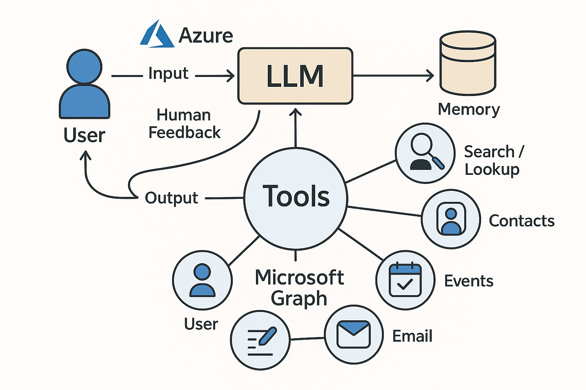
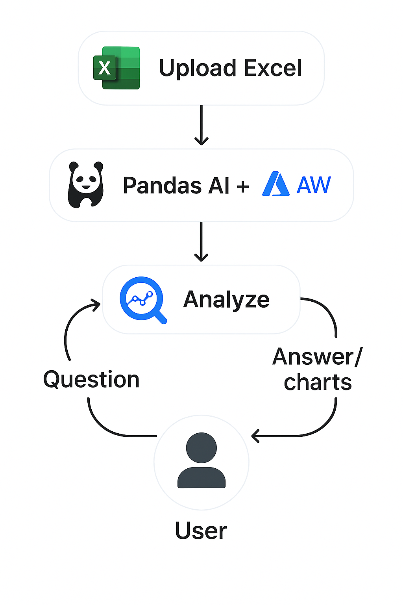
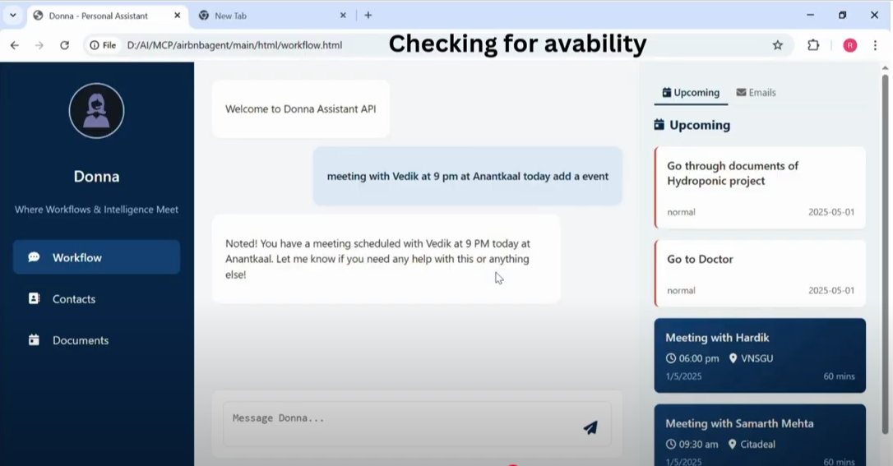
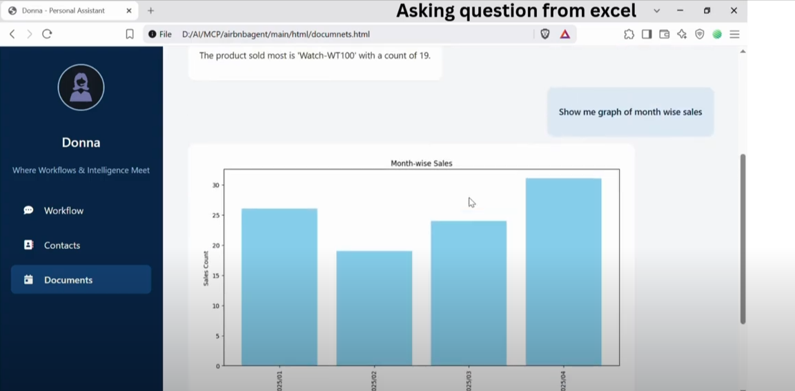

# 📊 Donna Business Agent

**Donna** is an **AI-powered business assistant** that automates routine tasks like email handling, calendar scheduling, and team collaboration. It also intelligently analyzes business documents such as PDFs, Excel files, and CSVs. With a powerful chatbot interface, Donna integrates seamlessly with **Microsoft Graph API**, **Azure OpenAI**, **PandasAI**, and more.

---

## 🧠 Key Features

- 🤖 **Conversational AI** – Chatbot interface powered by LLMs (Azure OpenAI)
- 📄 **Smart Document Processing** – Analyze PDFs, Excel, and CSVs using AI
- 📧 **Business Task Automation** – Manage emails, calendars, Teams messages
- ☁️ **Integrated Tools** – Leverages Microsoft Graph API & Azure Document Intelligence
- 📈 **AI Data Analysis** – Uses PandasAI to handle data-centric queries and visualizations

---

## 🛠️ Tech Stack

- **FastAPI**
- **Azure OpenAI** (LLMs)
- **PandasAI**
- **Azure Document Intelligence**
- **Microsoft Graph API**

---


# 🧩 Key Modules

## 1. Workflow Management Module  
**Natural Language Chatbot UI**

Handles:

- 📅 Tasks & Events  
- 📧 Emails  
- 📇 Contacts  
- 🧑 Users  
- 💬 Microsoft Teams  

Powered by:  
**Microsoft Graph API + Tavily Search API**

#### 🧠 Step-by-Step Explanation

1. **User Input**  
   The user types a natural language prompt, such as:  
   - “Schedule a meeting with Alex next week”  
   - “What’s the latest update on Tesla from the web?”

2. **NLP via LLM (Azure OpenAI)**  
   The AI processes the input to:
   - Understand the intent  
   - Extract parameters like names, dates, actions  
   - Detect if any required details are missing

3. **Check for Missing Parameters**  
   - ✅ If complete: proceed to the appropriate API  
   - ❌ If incomplete: ask the user for missing info  
     e.g., “What time should I schedule the meeting with Alex?”

4. **Call Appropriate Tool/API**  
   - 📧 For email, calendar, Teams → Use **Microsoft Graph API**  
   - 🔍 For real-time web info → Use **Tavily Search API**

5. **Return Output to User**  
   The system responds naturally, e.g.:  
   - “Meeting with Alex scheduled for Tuesday at 2 PM.”  
   - “Here’s the latest news on Tesla: [summary]”



---

## 2. Document Analyzer Module  

### 📝 Description
This module enables users to upload documents (PDF, Excel, CSV) and interact with their content using natural language. Users can ask questions, extract insights, and even generate graphs—all through a conversational interface.

---


### 🔁 Workflow Flowchart

#### A) 📄 **For PDF Files**  
- PandasAI loads the spreadsheet into memory and interprets questions like:  
  *“Show sales trends over the last 6 months”*  
- The system can respond with:
  - Plain answers (e.g., summaries, totals)
  - Dynamic charts (bar, line, pie) based on the file contents

---

### ✅ Example Use Cases

- Summarizing financial reports in PDFs  
- Generating trend graphs from Excel sales data  
- Finding anomalies or totals in large CSV files


### 🛠️ Technologies Used

- **Azure Document Intelligence** → For structured PDF extraction and parsing  
- **PandasAI + LLM (GPT-4)** → For querying and analyzing Excel/CSV files  
- **Azure AI Foundry** → Integrates GPT-4 capabilities into the analysis pipeline  

---



---

## 📚 Features

- 🔍 Web Search via Tavily API  
- 🧠 NLP via Azure OpenAI (GPT-4)  
- ✅ Intelligent parameter extraction and feedback loop  
- 📊 Analyze Excel files and generate graphs in seconds  
- 📄 Summarize PDFs using AI  
- ✉️ Send emails by simply giving a prompt  
- 📅 Manage meetings by checking participants' availability
- 


## 🚀 UI Overview

Donna – The AI-Powered Business Agent – is structured across three interactive pages, each offering powerful features to streamline your productivity using AI + Microsoft Graph.

---

### 📄 Page 1: Workflow Management Dashboard



#### 🔹 Description:
This is your main control hub. On this page, you can:
- View **today's tasks and events**
- See **recent emails**
- Interact with the **Natural Language Chatbot** to perform a wide range of operations

#### 🧠 NLP Chatbot Capabilities:

- You can get or add new contacts using simple commands like "Add contact for John Doe".
- You can manage events by adding, deleting, or updating them. You can also view all upcoming events or just today's events.
- The chatbot lets you set or get your current presence status (like Available or Busy).
- You can add new tasks, delete existing ones, or list all your tasks—including filtering for just today's tasks.
- You can join Microsoft Teams, send messages to team members, and list all your available teams.
- User management is also possible—delete a user, update someone's display name, create new users, or list all users in your organization.
- You can fetch or send emails directly by typing what you want to say, and the agent will even format the email for you.
- You can perform a web search by just typing your query into the chatbot.


#### ✅ Key Features:
1. ✉️ **Email Formatter & Sender**  
   Type:  
   `"Write an email to Rahul about project delay"`  
   → The agent formats the email and asks you for approval before sending it to Rahul (using contact info).

2. ✅ **Smart Task Management**  
   Add, delete, or update your to-do items using simple phrases like:  
   `"Add a task to submit the report by 5 PM"`  

3. 📅 **Smart Event Scheduling**  
   Donna checks your availability before scheduling meetings or events.  
   You can also delete or update events with ease.

---

### 👤 Page 2: Contact Management


#### 🔹 Description:
This page allows you to:
- Add new contacts
- View existing contact details

The chatbot references this contact list when performing operations like sending emails or scheduling events.

---

### 📑 Page 3: Document Analyzer



#### 🔹 Description:
Upload PDF, Excel, or CSV files and ask any question related to the document's data.

#### ✅ Key Features:
1. 📄 **Smart PDF Reader**  
   - Summarizes complex documents  
   - Answers specific questions like:  
     `"What are the contract terms?"` or `"Summarize the report"`  

2. 📊 **Advanced Excel/CSV Analyzer**  
   - Supports multi-sheet Excel files  
   - Type a question like: `"Show revenue by department"`  
   - Automatically generates graphs  
   - Supports `.csv` files as well

###  Clone the Repository

```bash
git clone https://github.com/your-username/donna-business-agent.git
cd donna-business-agent

pip install -r requirements.txt

uvicorn api:app --reload

